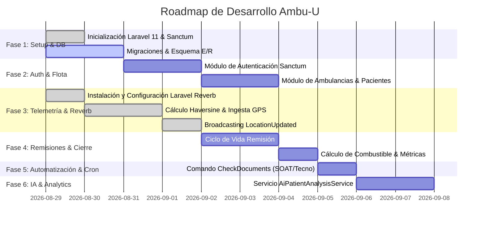

# 🗺️ Roadmap MOC: Plan de Implementación Ambu-U

Este documento desglosa las fases de desarrollo de la API backend de **Ambu-U**, el estado de cada tarea y las prioridades de ejecución técnica.

---

## 🎯 Resumen de Fases

---

## 📌 Detalle de Fases y Backlog

### Fase 1: Inicialización, Entorno y Persistencia
- [x] Configuración inicial del repositorio Laravel 11.x.
- [x] Estructuración del Cerebro de Conocimiento en Obsidian (`docs/brain`).
- [ ] Ejecución de `php artisan install:api` (Sanctum).
- [x] Creación de migraciones de base de datos:
  - [x] `users` (con campos extendidos: `phone`, `role`, `is_active`).
  - [x] `ambulances` (placa, marca, modelo, km/galón, vencimientos SOAT/Tecnomecánica, estado).
  - [x] `patients` (identificación, nombres, apellidos, EPS, flag caso SOAT, notas).
  - [x] `remissions` (código único, FKs, direcciones origen/destino, estado, métricas acumuladas e índices).
  - [x] `remission_occupants` (remission_id cascade, nombre, identificación, rol).
  - [x] `locations` (telemetría GPS, velocidad, rumbo, timestamp e índices compuestos).
- [x] Creación de Modelos Eloquent (`User`, `Ambulance`, `Patient`, `Remission`, `RemissionOccupant`, `Location`) con casts y relaciones.

### Fase 2: Autenticación y Catálogos Operativos
- [x] Implementar [[Auth-Module]]:
  - [x] `POST /api/login` (Generación de Sanctum Tokens con claims de rol).
  - [x] `POST /api/logout` (Revocación segura de tokens).
  - [x] `GET /api/me` (Consulta de perfil de usuario autenticado).
- [x] Implementar [[Fleet-Ambulances]]:
  - [x] `GET /api/ambulances` (Filtro por estado y documentación).
  - [x] `GET /api/ambulances/available` (Filtro por ambulancias disponibles).
  - [x] CRUD completo de ambulancias (`StoreAmbulanceRequest`, `UpdateAmbulanceRequest`).
- [x] Implementar Gestión de Pacientes:
  - [x] `GET /api/patients` (Búsqueda por cédula, nombre o EPS).
  - [x] `POST /api/patients` (Creación con `StorePatientRequest`).
  - [x] CRUD completo de pacientes (`UpdatePatientRequest`, `destroy`).

### Fase 3: Telemetría en Tiempo Real y WebSockets
- [x] Configuración completa de Laravel Reverb y canales de transmisión WebSockets (Broadcasting).
- [x] Implementar [[Telemetry-Haversine]]:
  - [x] Servicio de cálculo de distancia mediante fórmula Haversine (`HaversineDistanceService`).
  - [x] Servicio de procesamiento e ingesta de telemetría (`TelemetryProcessingService`).
  - [x] Evento `LocationUpdated` y difusión vía WebSocket en Reverb (`LocationUpdated`).
  - [x] Endpoint `POST /api/remissions/{id}/location` y controlador HTTP (`RemissionController@recordLocation`).
  - [x] Endpoint `GET /api/remissions/{id}/locations` (`RemissionController@locations`).

### Fase 4: Operación de Remisiones y Consumo de Combustible
- [x] Implementar [[Remissions-Tracking]]:
  - [x] Servicio de ciclo de vida de remisiones (`RemissionLifecycleService` con correlativo, estados, ocupantes y cálculo de combustible).
  - [x] `POST /api/remissions` (Creación e inicio de traslado con `StoreRemissionRequest`).
  - [x] `PATCH /api/remissions/{id}/start-transfer` (Transición a `trasladando`).
  - [x] `PUT /api/remissions/{id}/finish` (Cálculo de galones consumidos: $\text{total\_km} / \text{km\_per\_gallon}$, notas de cierre y estampa `finished_at`).
  - [x] `POST /api/remissions/{id}/cancel` (Cancelación con motivo justificado y liberación de móvil).
  - [x] `GET /api/stats/ambulances/{id}` (Métricas de rendimiento por móvil).
  - [x] `GET /api/stats/fleet` y `GET /api/stats/remissions` (Métricas de flota y remisiones globales).

### Fase 5: Tareas Programadas y Alertas
- [x] Comando Artisan `CheckExpiringDocumentsCommand` (`app/Console/Commands/CheckExpiringDocumentsCommand.php` -> `ambulances:check-expiring-docs`).
- [x] Detección de vencimientos a 5 días o menos para SOAT y Tecnomecánica con logs y salida en consola.
- [x] Registro programado en `app/Console/Kernel.php` con frecuencia diaria (`dailyAt('07:00')`).

### Fase 6: Inteligencia Artificial (Opcional)
- [ ] `AiPatientAnalysisService` usando OpenAI / Vertex AI con `guzzlehttp/guzzle`.
- [ ] Análisis de triaje y severidad clínica a partir de texto libre de observaciones.

---

## 🔗 Navegación

- Volver al inicio: [[Home]]
- Arquitectura: [[Architecture-MOC]]
- Reglas del negocio: [[Business-Rules]]
