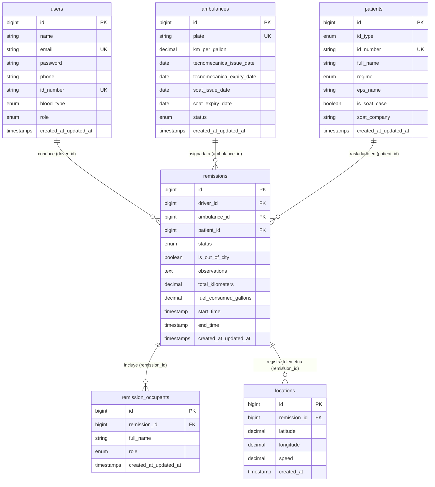

# 🗄️ Data Dictionary: Ambu-U

Especificación detallada de todas las entidades de base de datos, tipos de columnas, restricciones, índices y relaciones para **MySQL 8.x / MariaDB**.

---

## 📊 Diagrama Entidad-Relación (E/R)

---

## 📑 Definición de Tablas

### 1. Tabla: `users`
Almacena credenciales de acceso para la aplicación móvil y panel web, además de datos médicos básicos del conductor.

| Campo | Tipo SQL | Nulo | Por Defecto | Restricciones / Descripción |
| :--- | :--- | :--- | :--- | :--- |
| `id` | `BIGINT UNSIGNED` | No | Auto-increment | Primary Key |
| `name` | `VARCHAR(255)` | No | - | Nombre completo del usuario/conductor |
| `email` | `VARCHAR(255)` | No | - | Unique Index. Correo electrónico para login |
| `password` | `VARCHAR(255)` | No | - | Hash de la contraseña (Bcrypt / Argon2) |
| `phone` | `VARCHAR(50)` | No | - | Teléfono móvil de contacto |
| `id_number` | `VARCHAR(50)` | No | - | Unique Index. Cédula de ciudadanía |
| `blood_type` | `ENUM` | No | - | Valores: `'A+','A-','B+','B-','AB+','AB-','O+','O-'` |
| `role` | `ENUM` | No | `'driver'` | Valores: `'driver'`, `'admin'` |
| `created_at` | `TIMESTAMP` | Sí | `NULL` | Laravel standard timestamp |
| `updated_at` | `TIMESTAMP` | Sí | `NULL` | Laravel standard timestamp |

---

### 2. Tabla: `ambulances`
Parque automotor disponible, consumo base y control de documentos legales.

| Campo | Tipo SQL | Nulo | Por Defecto | Restricciones / Descripción |
| :--- | :--- | :--- | :--- | :--- |
| `id` | `BIGINT UNSIGNED` | No | Auto-increment | Primary Key |
| `plate` | `VARCHAR(20)` | No | - | Unique Index. Placa de la ambulancia (ej. ABC-123) |
| `km_per_gallon` | `DECIMAL(8,2)` | No | - | Kilómetros recorridos por galón de combustible |
| `tecnomecanica_issue_date` | `DATE` | No | - | Fecha de expedición revisión técnico-mecánica |
| `tecnomecanica_expiry_date` | `DATE` | No | - | Index. Fecha de vencimiento revisión técnico-mecánica |
| `soat_issue_date` | `DATE` | No | - | Fecha de expedición seguro obligatorio SOAT |
| `soat_expiry_date` | `DATE` | No | - | Index. Fecha de vencimiento SOAT |
| `status` | `ENUM` | No | `'active'` | Valores: `'active'`, `'maintenance'`, `'inactive'` |
| `created_at` | `TIMESTAMP` | Sí | `NULL` | Laravel standard timestamp |
| `updated_at` | `TIMESTAMP` | Sí | `NULL` | Laravel standard timestamp |

---

### 3. Tabla: `patients`
Registro único de pacientes trasladados y cobertura en salud.

| Campo | Tipo SQL | Nulo | Por Defecto | Restricciones / Descripción |
| :--- | :--- | :--- | :--- | :--- |
| `id` | `BIGINT UNSIGNED` | No | Auto-increment | Primary Key |
| `id_type` | `ENUM` | No | `'CC'` | Valores: `'CC'`, `'TI'`, `'CE'`, `'RC'`, `'PAS'` |
| `id_number` | `VARCHAR(50)` | No | - | Unique Index. Número de identificación |
| `full_name` | `VARCHAR(255)` | No | - | Nombre completo del paciente |
| `regime` | `ENUM` | No | - | Valores: `'Contributivo'`, `'Subsidiado'`, `'Particular'`, `'Vinculado'` |
| `eps_name` | `VARCHAR(255)` | No | - | Entidad promotora de salud (EPS) |
| `is_soat_case` | `BOOLEAN` | No | `false` | Indica si el traslado corresponde a accidente de tránsito |
| `soat_company` | `VARCHAR(255)` | Sí | `NULL` | Nombre de la compañía aseguradora de SOAT |
| `created_at` | `TIMESTAMP` | Sí | `NULL` | Laravel standard timestamp |
| `updated_at` | `TIMESTAMP` | Sí | `NULL` | Laravel standard timestamp |

---

### 4. Tabla: `remissions`
Entidad central que registra el servicio de traslado, métricas acumuladas de viaje y estado.

| Campo | Tipo SQL | Nulo | Por Defecto | Restricciones / Descripción |
| :--- | :--- | :--- | :--- | :--- |
| `id` | `BIGINT UNSIGNED` | No | Auto-increment | Primary Key |
| `driver_id` | `BIGINT UNSIGNED` | No | - | FK -> `users.id` |
| `ambulance_id` | `BIGINT UNSIGNED` | No | - | FK -> `ambulances.id` |
| `patient_id` | `BIGINT UNSIGNED` | No | - | FK -> `patients.id` |
| `status` | `ENUM` | No | `'en_camino'` | Valores: `'en_camino'`, `'trasladando'`, `'finalizado'` |
| `is_out_of_city` | `BOOLEAN` | No | `false` | Flag para traslados intermunicipales |
| `observations` | `TEXT` | Sí | `NULL` | Notas clínicas o incidencias de ruta |
| `total_kilometers` | `DECIMAL(10,2)` | No | `0.00` | Distancia total acumulada en KM (Haversine) |
| `fuel_consumed_gallons` | `DECIMAL(10,2)` | No | `0.00` | Galones calculados al finalizar viaje |
| `start_time` | `TIMESTAMP` | Sí | `NULL` | Hora de inicio del servicio |
| `end_time` | `TIMESTAMP` | Sí | `NULL` | Hora de finalización del servicio |
| `created_at` | `TIMESTAMP` | Sí | `NULL` | Laravel standard timestamp |
| `updated_at` | `TIMESTAMP` | Sí | `NULL` | Laravel standard timestamp |

---

### 5. Tabla: `remission_occupants`
Tripulantes médicos o acompañantes a bordo durante la remisión.

| Campo | Tipo SQL | Nulo | Por Defecto | Restricciones / Descripción |
| :--- | :--- | :--- | :--- | :--- |
| `id` | `BIGINT UNSIGNED` | No | Auto-increment | Primary Key |
| `remission_id` | `BIGINT UNSIGNED` | No | - | FK -> `remissions.id` (`ON DELETE CASCADE`) |
| `full_name` | `VARCHAR(255)` | No | - | Nombre completo del ocupante |
| `role` | `ENUM` | No | - | Valores: `'Médico'`, `'Enfermero'`, `'Familiar'`, `'Estudiante'`, `'Otro'` |
| `created_at` | `TIMESTAMP` | Sí | `NULL` | Laravel standard timestamp |
| `updated_at` | `TIMESTAMP` | Sí | `NULL` | Laravel standard timestamp |

---

### 6. Tabla: `locations`
Telemetría y registro histórico de coordenadas GPS.

| Campo | Tipo SQL | Nulo | Por Defecto | Restricciones / Descripción |
| :--- | :--- | :--- | :--- | :--- |
| `id` | `BIGINT UNSIGNED` | No | Auto-increment | Primary Key |
| `remission_id` | `BIGINT UNSIGNED` | No | - | FK -> `remissions.id` (`ON DELETE CASCADE`) |
| `latitude` | `DECIMAL(10,8)` | No | - | Latitud GPS (-90.00000000 a +90.00000000) |
| `longitude` | `DECIMAL(11,8)` | No | - | Longitud GPS (-180.00000000 a +180.00000000) |
| `speed` | `DECIMAL(8,2)` | Sí | `NULL` | Velocidad reportada por el sensor en km/h |
| `created_at` | `TIMESTAMP` | No | Current Timestamp | Index compuesto: `(remission_id, created_at)` |

---

## 🔗 Referencias Cruzadas

- [[Business-Rules]]: Lógica de validación y cálculos.
- [[API-Contracts]]: Endpoints que operan sobre estos modelos.
- [[Architecture-MOC]]: Diagramas de flujo y arquitectura general.
