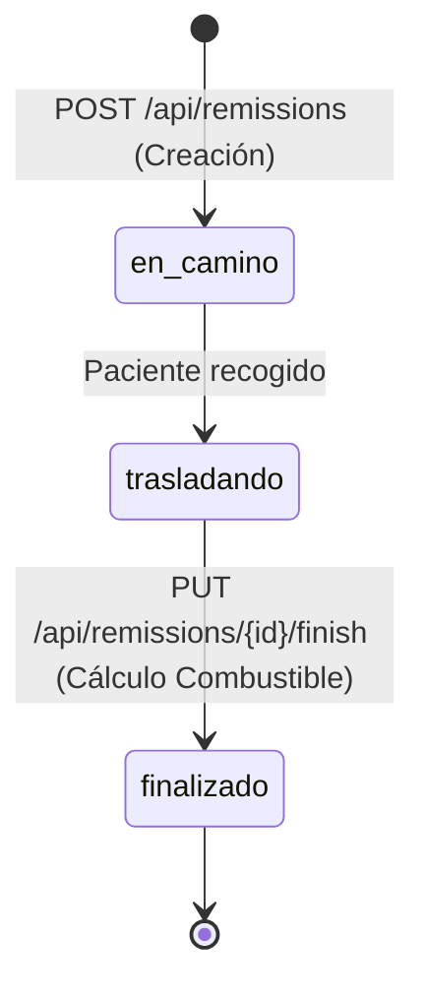

# 📋 Remissions & Operations Module

Este módulo constituye el núcleo de la operación médica y logística de **Ambu-U**, controlando el ciclo de vida de los traslados desde la asignación del paciente hasta el cierre del servicio y el cálculo de indicadores de rendimiento.

---

## 🎯 Responsabilidades del Módulo
1. Registro e inicio de la remisión asociando conductor, ambulancia, paciente y ocupantes.
2. Gestión de estados del traslado: `en_camino` -> `trasladando` -> `finalizado`.
3. Registro de ocupantes y acompañantes (`remission_occupants`).
4. Finalización del servicio, cálculo automático de galones de combustible consumidos y registro de la hora de llegada (`end_time`).
5. Generación de estadísticas operativas e históricos por ambulancia y conductor.

---

## 🔄 Máquina de Estados de la Remisión



---

## 📐 Diseño de Clases y Estructura

```
app/
├── Http/
│   ├── Controllers/
│   │   └── Api/
│   │       ├── PatientController.php
│   │       ├── RemissionController.php
│   │       └── StatsController.php
│   ├── Requests/
│   │   ├── StorePatientRequest.php
│   │   ├── StoreRemissionRequest.php
│   │   └── FinishRemissionRequest.php
│   └── Resources/
│       ├── PatientResource.php
│       └── RemissionResource.php
├── Models/
│   ├── Patient.php
│   ├── Remission.php
│   └── RemissionOccupant.php
└── Services/
    └── RemissionService.php
```

---

## ⛽ Algoritmo de Cierre y Cálculo de Combustible

Al invocar `finish()` en `RemissionController`:

```php
public function finish(FinishRemissionRequest $request, Remission $remission): JsonResponse
{
    if ($remission->status === 'finalizado') {
        return response()->json(['message' => 'La remisión ya ha sido finalizada previamente.'], 400);
    }

    $ambulance = $remission->ambulance;
    $kmPerGallon = (float) $ambulance->km_per_gallon;

    $fuelConsumed = $kmPerGallon > 0
        ? round((float) $remission->total_kilometers / $kmPerGallon, 2)
        : 0.00;

    $remission->update([
        'status' => 'finalizado',
        'fuel_consumed_gallons' => $fuelConsumed,
        'end_time' => now(),
        'observations' => $request->input('observations_closing', $remission->observations),
    ]);

    return response()->json([
        'success' => true,
        'message' => 'Remisión finalizada exitosamente',
        'data' => new RemissionResource($remission)
    ]);
}
```

---

## 🔗 Referencias Cruzadas
- [[Business-Rules]]: Reglas de operación de traslados (`RN-REM-01` a `RN-FIN-03`).
- [[Data-Dictionary]]: Esquema de `remissions`, `patients` y `remission_occupants`.
- [[Telemetry-Haversine]]: Motor de telemetría que acumula kilometraje en la remisión.
