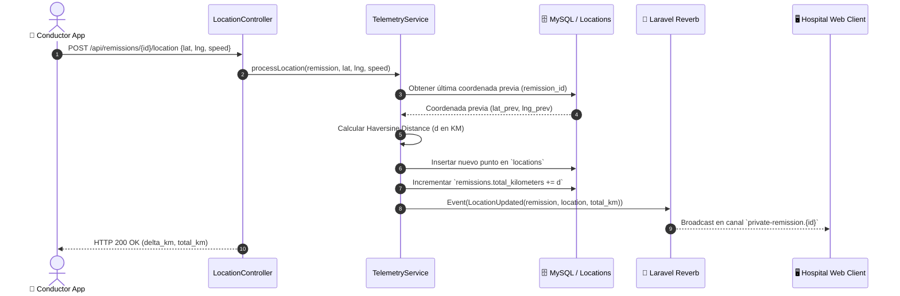

# 📡 Telemetry & Haversine Distance Module

Este módulo implementa el pipeline de ingesta de coordenadas GPS a alta frecuencia, el cálculo matemático geodésico incremental (Fórmula de Haversine) y la propagación de eventos en tiempo real mediante **Laravel Reverb**.

---

## 🎯 Responsabilidades del Módulo
1. Recepción y validación estricta de coordenadas geográficas (`latitude`, `longitude`, `speed`).
2. Búsqueda eficiente del último punto de geolocalización registrado para la remisión activa.
3. Ejecución del cálculo de distancia geodésica entre el punto previo y el actual.
4. Acumulación atómica del kilometraje en `remissions.total_kilometers`.
5. Emisión de eventos WebSockets a través de `LocationUpdated` hacia **Laravel Reverb**.

---

## 📐 Pipeline de Ingesta y Cálculo



---

## 🧮 Fundamentación Matemática: Fórmula de Haversine

Dadas dos coordenadas geográficas $(\phi_1, \lambda_1)$ y $(\phi_2, \lambda_2)$ expresadas en radianes, la distancia geodésica sobre una esfera de radio $R = 6371.0088\text{ km}$ se calcula como:

$$\Delta\phi = \phi_2 - \phi_1$$
$$\Delta\lambda = \lambda_2 - \lambda_1$$
$$a = \sin^2\left(\frac{\Delta\phi}{2}\right) + \cos(\phi_1)\cos(\phi_2)\sin^2\left(\frac{\Delta\lambda}{2}\right)$$
$$c = 2 \cdot \operatorname{atan2}\left(\sqrt{a}, \sqrt{1-a}\right)$$
$$d = R \cdot c$$

### Implementación en PHP 8.2+

```php
namespace App\Services;

class HaversineDistanceService
{
    private const EARTH_RADIUS_KM = 6371.0088;

    public function calculate(
        float $lat1,
        float $lon1,
        float $lat2,
        float $lon2
    ): float {
        if ($lat1 === $lat2 && $lon1 === $lon2) {
            return 0.0;
        }

        $latFrom = deg2rad($lat1);
        $lonFrom = deg2rad($lon1);
        $latTo = deg2rad($lat2);
        $lonTo = deg2rad($lon2);

        $latDelta = $latTo - $latFrom;
        $lonDelta = $lonTo - $lonFrom;

        $angle = 2 * asin(sqrt(
            pow(sin($latDelta / 2), 2) +
            cos($latFrom) * cos($latTo) * pow(sin($lonDelta / 2), 2)
        ));

        return round($angle * self::EARTH_RADIUS_KM, 4);
    }
}
```

---

## ⚡ Transmisión WebSocket con Laravel Reverb

### 1. Configuración de Infraestructura
- **Servidor Reverb**: `config/reverb.php` configurado en `0.0.0.0:8080`.
- **Broadcasting Driver**: `config/broadcasting.php` con conexión `reverb` y soporte para `BROADCAST_CONNECTION=reverb`.
- **Variables de Entorno** (`.env.example`):
  - `BROADCAST_CONNECTION=reverb`
  - `REVERB_APP_ID=ambuu_app_id`
  - `REVERB_APP_KEY=ambuu_app_key`
  - `REVERB_APP_SECRET=ambuu_app_secret`
  - `REVERB_HOST="localhost"`
  - `REVERB_PORT=8080`
  - `REVERB_SCHEME=http`

### 2. Canales Privados y Autorización (`routes/channels.php`)
- `remission.{remissionId}`: Acceso restringido a usuarios con rol `admin` o al conductor asignado (`driver_id`) en la remisión.
- `ambulance.{ambulanceId}`: Acceso otorgado a usuarios autenticados activos (`is_active = true`).

### 3. Evento `LocationUpdated`
```php
namespace App\Events;

use App\Models\Location;
use App\Models\Remission;
use Illuminate\Broadcasting\InteractsWithSockets;
use Illuminate\Broadcasting\PrivateChannel;
use Illuminate\Contracts\Broadcasting\ShouldBroadcastNow;
use Illuminate\Foundation\Events\Dispatchable;
use Illuminate\Queue\SerializesModels;

class LocationUpdated implements ShouldBroadcastNow
{
    use Dispatchable, InteractsWithSockets, SerializesModels;

    public function __construct(
        public Remission $remission,
        public Location $location,
        public float $deltaKm = 0.0
    ) {}

    public function broadcastOn(): array
    {
        return [
            new PrivateChannel('remission.' . $this->remission->id),
        ];
    }

    public function broadcastWith(): array
    {
        return [
            'remission_id' => $this->remission->id,
            'ambulance_id' => $this->remission->ambulance_id,
            'latitude' => (float) $this->location->latitude,
            'longitude' => (float) $this->location->longitude,
            'speed' => $this->location->speed !== null ? (float) $this->location->speed : null,
            'heading' => $this->location->heading !== null ? (float) $this->location->heading : null,
            'delta_km' => round($this->deltaKm, 4),
            'total_kilometers' => (float) $this->remission->total_kilometers,
            'recorded_at' => $this->location->recorded_at?->toIso8601String() ?? now()->toIso8601String(),
        ];
    }

    public function broadcastAs(): string
    {
        return 'LocationUpdated';
    }
}
```

---

## 🔗 Referencias Cruzadas
- [[ADR-001-laravel-11-and-reverb]]: Decisión técnica sobre Reverb.
- [[Business-Rules]]: Reglas de negocio de telemetría (`RN-TEL-01` a `RN-TEL-04`).
- [[Data-Dictionary]]: Estructura de la tabla `locations` con índices compuestos.
- [[API-Contracts]]: Contrato del endpoint `/api/remissions/{id}/location`.

